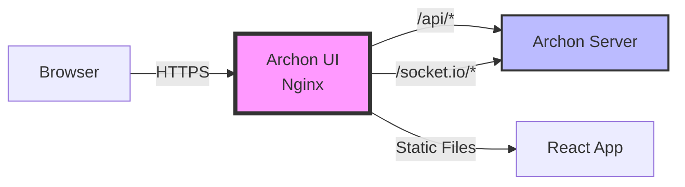

# Archon UI Railway Deployment 🚀

This repository provides a **production-ready deployment solution** for Archon UI on Railway with automatic API proxy configuration.

## 🎯 The Problem Solved

When deploying Archon UI separately from the server, you need:
- Proper API proxy configuration to connect to archon-server
- WebSocket support for real-time features
- Production-grade static file serving
- Automatic environment configuration

This repo solves all these issues with a single, optimized Docker image.

## ✅ Features

- **Multi-stage Docker build** - Minimal 40MB production image
- **Nginx reverse proxy** - Production-grade serving with API routing
- **Automatic configuration** - Uses Railway environment variables
- **WebSocket support** - Full Socket.IO compatibility
- **Health checks** - Built-in monitoring endpoint
- **Security headers** - Production-ready security configuration
- **Client-side routing** - Full React Router support
- **Optimized caching** - Static assets cached for 1 year

## 🚀 Quick Deploy to Railway

### Option 1: Deploy This Repo Directly (Recommended)

1. **Fork this repository**
2. **Clone and add Archon UI files:**
```bash
git clone https://github.com/YOUR_USERNAME/archon-ui-railway.git
cd archon-ui-railway

# Clone Archon and copy UI files
git clone https://github.com/coleam00/Archon.git archon-source
cp -r archon-source/archon-ui-main/* .
rm -rf archon-source

# Commit and push
git add .
git commit -m "Add Archon UI source files"
git push origin main
```

3. **Deploy to Railway:**
   - Go to [Railway Dashboard](https://railway.app/dashboard)
   - Click "New Project" → "Deploy from GitHub repo"
   - Select your forked `archon-ui-railway` repository
   - Railway will automatically detect the Dockerfile and start building

4. **Configure Environment Variables:**
   - In Railway, go to your service settings
   - Add variable: `ARCHON_SERVER_URL` = `https://archon-server-production.up.railway.app`
   - The URL should match your archon-server deployment

5. **Add a Domain:**
   - In service settings, go to "Networking"
   - Generate a Railway domain or add a custom domain

### Option 2: Update Existing archon-frontend Service

If you already have an `archon-frontend` service in Railway:

1. **Update the service to use this repository:**
   - Go to your archon-frontend service settings
   - Under "Source", disconnect the current repo
   - Connect this repository instead

2. **Update build settings:**
   - Root Directory: `/` (not `/archon-ui-main`)
   - Remove any custom build/start commands (Dockerfile handles everything)

3. **Set environment variable:**
   - `ARCHON_SERVER_URL` = `https://archon-server-production.up.railway.app`

## 🔧 How It Works



1. **Build Stage**: Node.js builds the Vite React app
2. **Production Stage**: Nginx serves static files
3. **API Proxy**: Nginx forwards `/api/*` and `/socket.io/*` to archon-server
4. **Dynamic Config**: Environment variables injected at container startup

## 📝 Environment Variables

| Variable | Description | Example |
|----------|-------------|---------|
| `ARCHON_SERVER_URL` | URL of your archon-server | `https://archon-server-production.up.railway.app` |
| `PORT` | Port to listen on (Railway sets this) | `8080` |

## 🏗️ Architecture Details

### Nginx Configuration
- Proxies `/api/*` → archon-server
- Proxies `/socket.io/*` → archon-server (WebSocket support)
- Serves static files with aggressive caching
- Handles client-side routing (returns index.html for all routes)
- Adds security headers (X-Frame-Options, CSP, etc.)

### Docker Optimization
- Multi-stage build reduces image from 500MB to 40MB
- Alpine Linux base for minimal footprint
- Build artifacts cached between deployments
- Health check endpoint at `/health`

## 🐛 Troubleshooting

### "Cannot connect to API"
- Check `ARCHON_SERVER_URL` is set correctly in Railway
- Verify archon-server is running and has a public domain
- Check Railway logs for proxy errors

### "WebSocket connection failed"
- Ensure archon-server supports WebSocket upgrade
- Check that both services are in the same Railway project
- Verify Socket.IO versions match

### "Build failed"
- Ensure all source files are copied from Archon repo
- Check package.json is present
- Verify Node version compatibility (v18)

## 🧪 Local Testing

```bash
# Build locally
docker build -t archon-ui .

# Run with local backend
docker run -p 3000:80 \
  -e PORT=80 \
  -e ARCHON_SERVER_URL=http://localhost:8181 \
  archon-ui

# Run with production backend
docker run -p 3000:80 \
  -e PORT=80 \
  -e ARCHON_SERVER_URL=https://archon-server-production.up.railway.app \
  archon-ui
```

## 📂 File Structure

```
archon-ui-railway/
├── Dockerfile              # Multi-stage build configuration
├── nginx.conf.template     # Nginx proxy configuration
├── docker-entrypoint.sh    # Runtime configuration script
├── railway.json           # Railway deployment config
├── copy-and-deploy.sh     # Setup helper script
└── [Archon UI files]      # Source files from archon-ui-main/
```

## 🤝 Contributing

Issues and PRs welcome! This is a community solution for deploying Archon on Railway.

## 📜 License

Same as Archon project - see original repository.

---

**Created to solve Archon UI deployment issues on Railway** 🎯